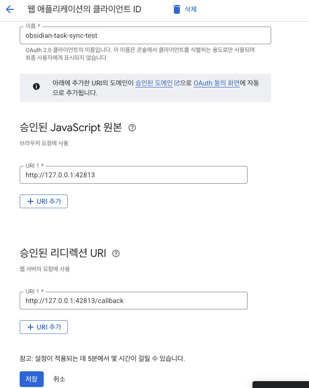
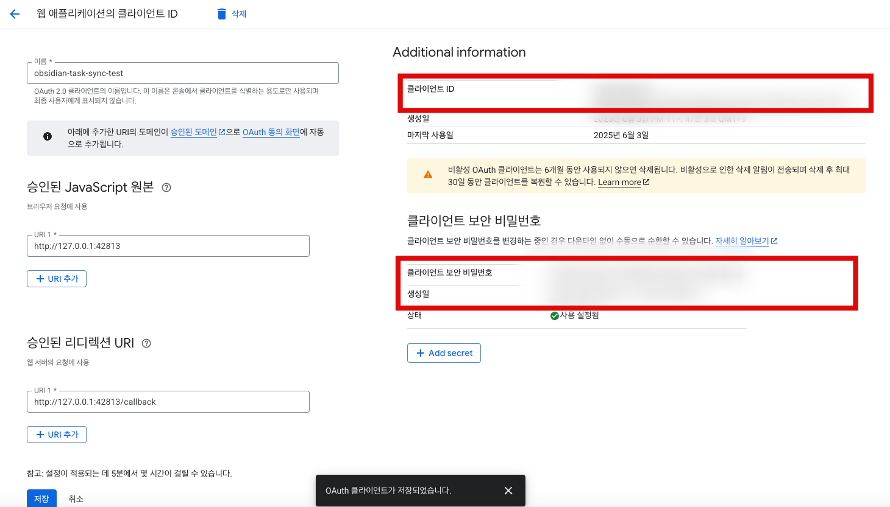

# Obsidian Task Sync

## Main feature

- Google Tasks에서 변경된 Task 상태를 Obsidian 문서에 반영
- Obsidian에서 Task를 수정하면 Google Tasks에도 자동 반영
- 마크다운 문서 내 Task(`- [ ] [Task Title](gtask:task-id)`)를 Google Tasks와 양방향 동기화
- 명령어(Command Palette)를 통한 Task 동기화/생성 지원
- Google OAuth2 인증 지원

## Installation

1. 플러그인 설치

- 이 저장소를 클론하거나 다운로드하여 Obsidian 플러그인 폴더(`.obsidian/plugins/`)에 복사합니다.
- `npm install` 후 `npm run dev`로 개발 모드에서 빌드할 수 있습니다.

2. **Google API 인증 정보 생성**

- Google Cloud Project를 생성합니다. [link](https://developers.google.com/workspace/guides/create-project)
- 사용자 인증 정보에서 OAuth 클라이언트 ID 만듭니다.
- 애플리케이션 유형을 Web Application으로 선택합니다.
- 승인된 자바 스크립트 원본에 `http://127.0.0.1:42813`을 등록합니다.
- 승인된 리디렉션 URI에 `http://127.0.0.1:42813/callback`을 등록합니다.
- 최종적으로 OAuth 클라이언트 ID를 만들 떄 아래 사진처럼 나옵니다. 

3. 본인의 gmail을 GCP에 등록하기

- 이후 등록할 Google Task 에 사용할 Google 계정을 GCP에서 등록해야 합니다.
- OAuth 동의화면 -> 대상에서 본인의 gmail을 입력합니다.
- 최종 입력상태는 아래와 같습니다.

4. **Google API 인증 정보 입력**

- 이 그림처럼 생성된 곳에서 아래와 같은 설정 값을 복사합니다.
  - plugin 설정창에서 클라이언트 ID을 복사해 Google API Client ID에 입력합니다.
  - plugin 설정창에서 클라이언트 비밀번호를 복사해 Google API Secret에 입력합니다.
- 이후 로그인 버튼을 눌러서 본인의

5. **Task 동기화**

- 명령어 팔레트(Command Palette)에서 "Turn into Google Task" 또는 "동기화" 명령을 실행합니다.
- 마크다운 문서 내 Task가 Google Tasks와 동기화됩니다.

## 마크다운 Task 포맷

```markdown
- [ ] [Task 제목](gtask:task-id)
- [x] [완료된 Task](gtask:task-id)
```

- `[ ]` : 미완료, `[x]` : 완료
- `gtask:task-id`는 Google Task의 고유 ID입니다.

## 기여 및 문의

- 외부기여를 환영합니다.
- 자세한 API 문서는 [Obsidian API 문서](https://github.com/obsidianmd/obsidian-api)를 참고하세요.
