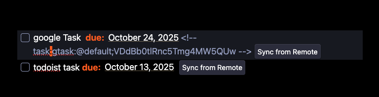

# Obsidian Task Sync

A plugin that helps you synchronize your Obsidian tasks with various task management platforms.

## ✨ Features

- Bi-directional task synchronization
- Support for multiple task platforms
- Command palette integration for task management
- Real-time status updates
- Markdown-friendly task format

## 🔌 Supported Platforms

Currently supported platforms:

- [Google Tasks](docs/platform/GTask.md)
- [Todoist](docs/platform/Todoist.md)

Coming soon:

- Microsoft To Do
- Want to add your favorite platform?
  - [Create an issue!](https://github.com/hong-sile/obsidian-tasks-sync/issues)

## 🚀 Getting Started

1. Install the plugin from Obsidian Community Plugins
2. Choose your preferred task platform
3. Follow the platform-specific setup guide
4. Start syncing your tasks!

## How to use

Creating Task

- Write your task in Obsidian using the standard checkbox format
- Use the command palette (Cmd/Ctrl + P) and select "Turn into Google Task" or "Turn into Todoist Task"
- The task will be created on the selected platform and synced automatically

Syncing Changes

- From Obsidian to Remote:
  - Check/uncheck the checkbox
  - Edit the task content
  - Changes are **automatically** synced to the remote platform
- From Remote to Obsidian:
  - Make changes in Google Tasks or Todoist
  - Changes will be reflected in your Obsidian notes
  - "Sync from Remote" button appears when remote changes are detected



## 🤝 Contributing

welcome contributions! Whether you want to:

- Add support for a new task platform
- Fix bugs or improve existing features
- Enhance documentation

Check out our [Contributing Guide](docs/contributing.md) to get started.

## 📝 Task Format

```markdown
- [ ] Task Title <!--platform:taskId:additional-info-->
```

See platform-specific documentation for detailed format information.

## 📚 Documentation

- [Contributing Guidelines](docs/contributing.md)
- Supported Platforms:
  - [Google Tasks](docs/platform/GTask.md)
  - [Todoist](docs/platform/todoist.md)
