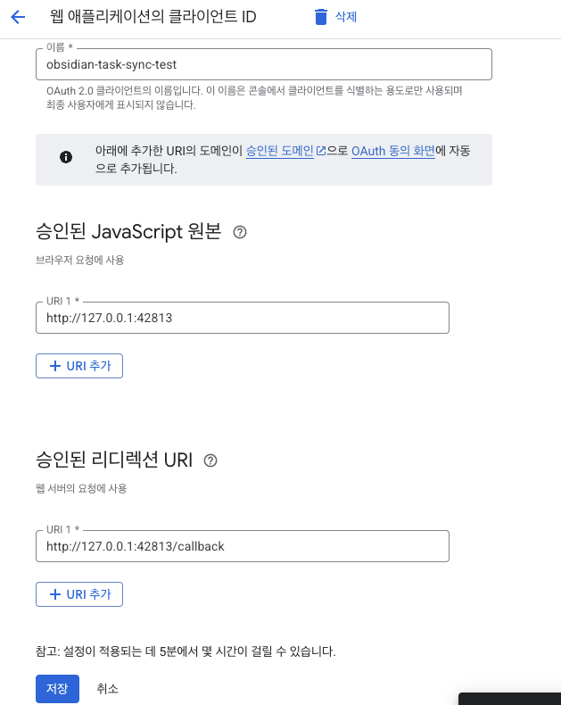

# Google Tasks Integration

This guide explains how to set up and use Google Tasks synchronization with Obsidian Task Sync plugin.

## 🔑 Setup Requirements

1. Google Cloud Project
2. OAuth 2.0 credentials
3. Google Tasks API enabled

## ⚙️ Installation Steps

### 1. Create Google Cloud Project

1. Create a project in [Google Cloud Console](https://developers.google.com/workspace/guides/create-project)
2. Enable Google Tasks API
   

### 2. Configure OAuth Credentials

1. Create OAuth client ID (Web Application)
2. Add authorized origins:
   - `http://127.0.0.1:42813`
3. Add redirect URI:
   - `http://127.0.0.1:42813/callback`
   - 

### 3. Register Test Users

1. Go to 'OAuth consent screen'
2. Add your Gmail under 'Test users'
   

### 4. Plugin Configuration

1. Copy credentials from Google Cloud Console
   
2. In Obsidian plugin settings:
   - Paste Client ID
   - Paste Client Secret
3. Click "Login" and authorize with your Google account

## 🔄 Usage

### Creating Tasks

1. Select text in Obsidian
2. Open Command Palette
3. Run "Turn into Google Task"

### Task Format

```markdown
- [ ] Task Title <!--gtask:taskId:tasklistId-->
- [x] Completed Task <!--gtask:taskId:tasklistId-->
```

### Synchronization

- **Obsidian → Google Tasks**: Changes sync automatically when you modify tasks
- **Google Tasks → Obsidian**: Automaticaly update

## 🔍 Troubleshooting

If you encounter authentication issues:

1. Verify your Client ID and Secret
2. Ensure you're using a registered test account
3. Check if Google Tasks API is enabled

## 📚 Additional Resources

- [Google Tasks API Documentation](https://developers.google.com/tasks)
- [OAuth 2.0 Setup Guide](https://developers.google.com/identity/protocols/oauth2)
