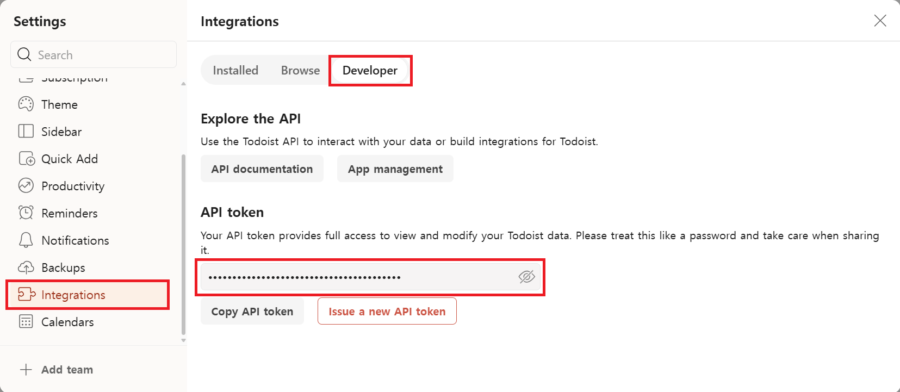
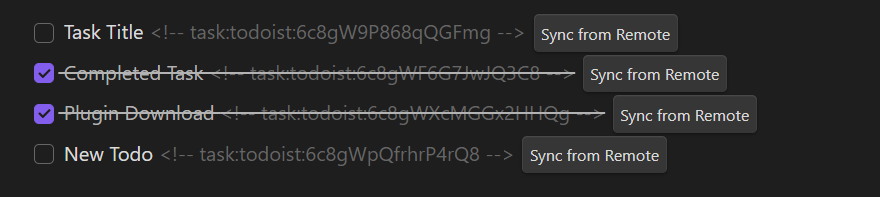

# Todoist Integration

This guide explains how to set up and use Todoist synchronization with Obsidian Task Sync plugin.

## 🔑 Setup Requirements

1. Set up Todoist API token
2. Plugin Configuration

## ⚙️ Installation Steps

### 1. Todoist API enabled

1. Sign in to Todoist [Todoist](https://app.todoist.com/app)
2. Go to **Settings**
3. Click on the **Integrations** tab from the left menu
4. Access to find the **Developer** section
5. Copy your Todoist **API token**
   

### 2. Plugin Configuration

1. In Obsidian plugin settings:
   - Paste your Todoist **API token**

## 🔄 Usage

### Creating Tasks

1. Select text in Obsidian
2. Open Command Palette
3. Run "Turn into Todoist Task"

### Task Format

```markdown
- [ ] Task Title <!-- task:todoist:tasklistId -->
- [x] Completed Task <!-- task:todoist:tasklistId -->
```

### Synchronization

- **Obsidian → Todoist**: Changes sync automatically when you modify tasks
- **Todoist → Obsidian**: Use the sync button to pull changes
  

## 🔍 Troubleshooting

If you encounter authentication issues:

1. Verify if the Todoist API has been updated
2. If the connection fails, please check if the settings were saved correctly

## 📚 Additional Resources

- [Todoist API Documentation](https://www.todoist.com/ko/help/articles/find-your-api-token-Jpzx9IIlB)
